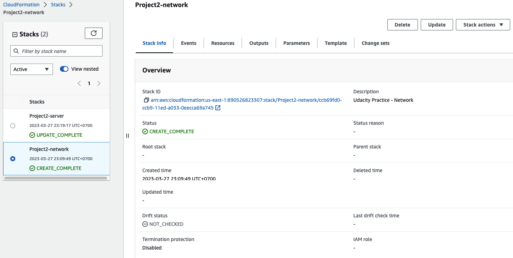

# Udacity - Project 2

Creating this project will give you the hands-on experience you need to confidently talk about infrastructure as code.

## Diagram

### Result

#### Cloudformation

#### Network

#### Server

#### Web App

